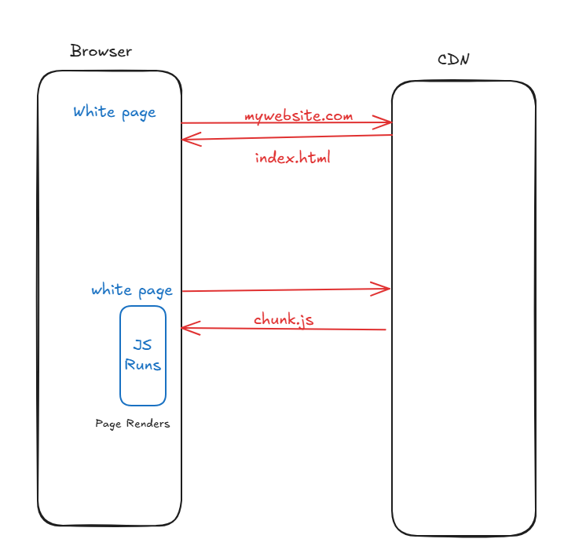
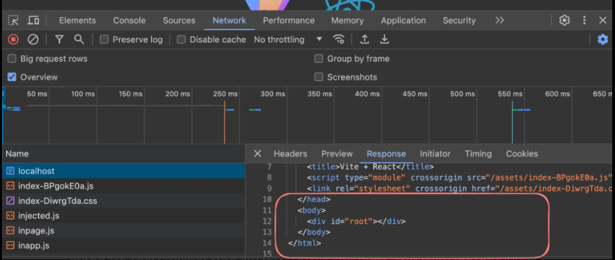
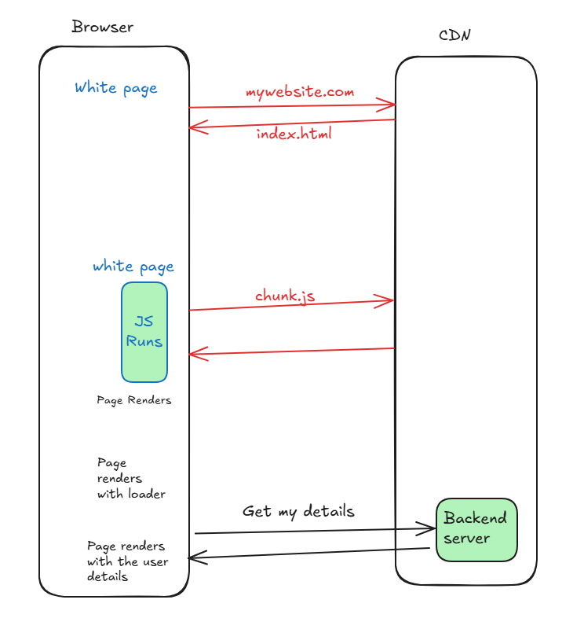

# Client Side Rendering 

Client Side Rendering (CSR) is a modern technique used in web development where the rendering of a webpage is performed in the browser using Js. 
Instead of the Server sending a full rendered HTML page to the client

Good Example of CSR is React 

let us see a react project in action 
1. Initialize a react project
 npm create vite@latest
 2. Add dependencies
   npm i 
3. Start the project 
    npm run build 
4. Serve the project 
    cd dist/
    serve

open the network tab and notice how the intial HTML file does not have any content

This means that the Js runs and actually populates / renders the contents on the page

React (or CSR) make your life as a developer easy. You write components, Js renders them to the DOM.

Downsides?
1. Not SEO optimized
2. User sees a flash before the page renders
3. Waterfalling problem 

Client-Side Rendering is a way websites work where most of the heavy lifting happens in your web browser, not on the server. When you visit a site, the server sends a basic file (usually some HTML, CSS, and JavaScript), and then your browser uses the JavaScript to build and display the full page. It’s like getting a recipe and cooking the meal yourself instead of having it delivered ready-made.

For example:

You load a page, and it might show a blank screen or a loading spinner at first.
Then, the JavaScript kicks in, fetches data (like a list of products or posts), and fills in the page.