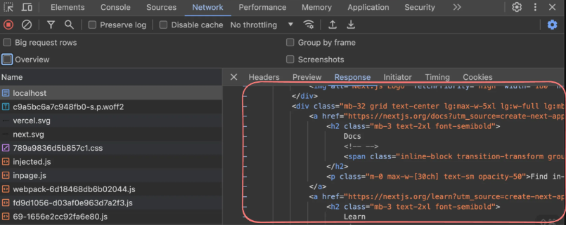

# Server Side Rendering

when the rendering process(converting Js components to HTML) happens on the server, it is called SSR

## why SSR?
1. SEO Optimizations
2. Gets rid of the waterfalling problem 
3. No white flash before you see content

Try creating a NextJs app and notice the HTML file you receive is populated 
1. Create a next app 
    npx create-next-app
2. Build the project
    npm run build
3. Start the Next server
    npm run start
Notice the initial HTML page is populated 

### Downsides of ssr ?
1. Expensive since every request needs to render on the server
2. Harder to scale , you can not cache to CDNs
