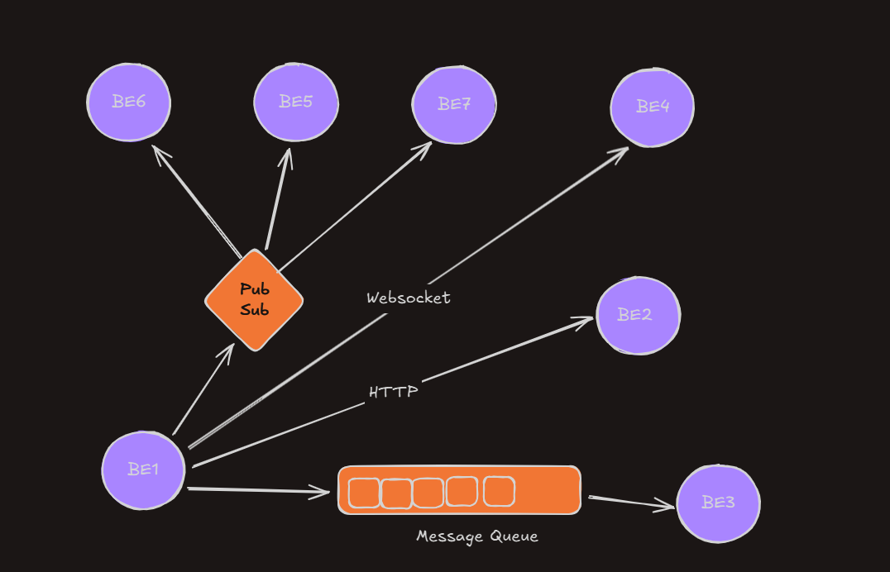
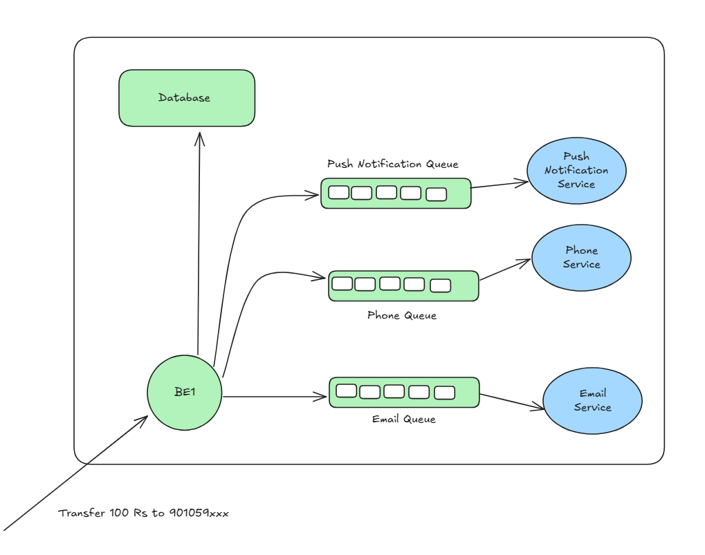
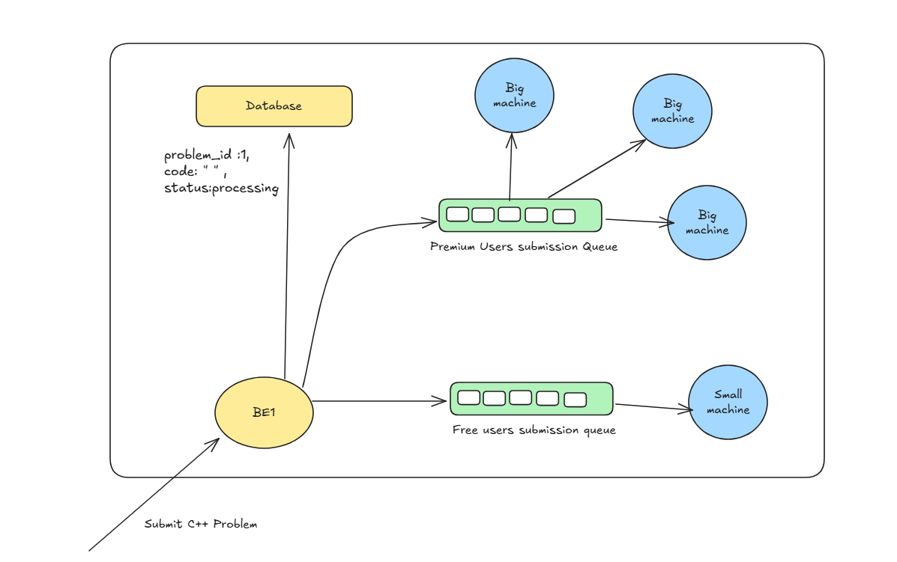

# why does different backend systems need to communicate with each other ?(Good interview question)
1. Separation of Responsibilities
    Different systems are often designed to do different things. For example, 
    1. Auth services handles authentication.
    2. Payment services manages billing and transactions
    3. Inventory Service tracks stock
Rather than building all of these into a single Massive app, it is cleaner and more maintainable to split them into separate services (a common microservices approach).But to work together, they need to talk to each other.

2.Distributed Systems and Microservices
 Modern backend architecture often follows microservices or service-oriented architecture(SOA). In these, each service is :
 1. Independent
 2.Owns its own data
 3.often deployed separately

 So services need to communication over APIs, message queues, or RPC to perform tasks collectively.

 Example :
 When a user places an order, the order service needs to talk to the inventory service to check stock, then call the shipping service to handle delivery.

 3. Data Synchronization and consistency
 In larger setups, data is often stored across different DBs or services. To ensure consistency:
 1. Services may sync data
 2.One service may publish events that others subscribe to (via message brokers like kafka or RabbitMQ) 
### asyc processes

#### asyc vs syn communictions (Great interview Question)

### what extra does websockets provide when compared to HTTP

# Types of Backend Communications
# what is backend communication?
In real world , you have various backend systems, not just one.

For example, for a website like PayTM, whenever you do a transaction, the following might happen.

for Leetcode, whenever the user submits a problem, the following might happen:
